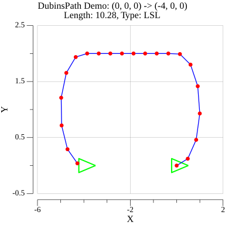
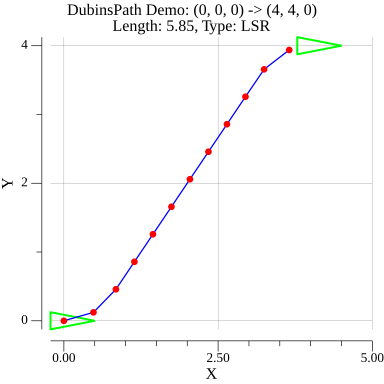
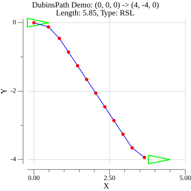
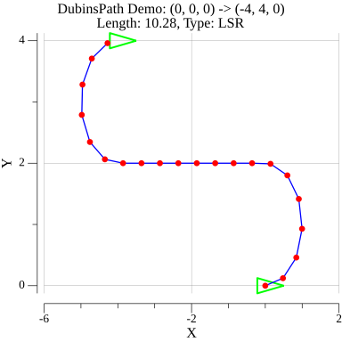
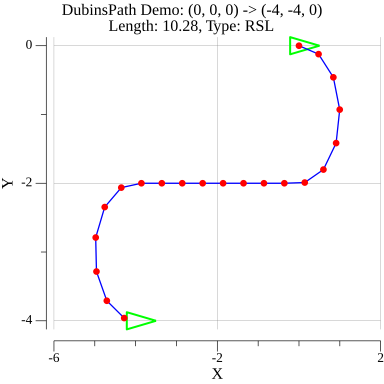
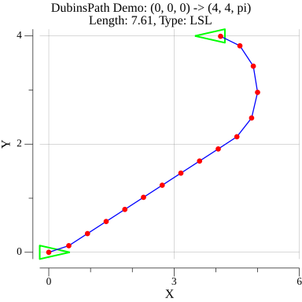
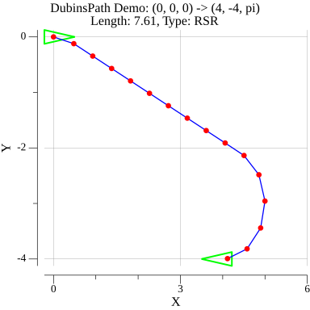
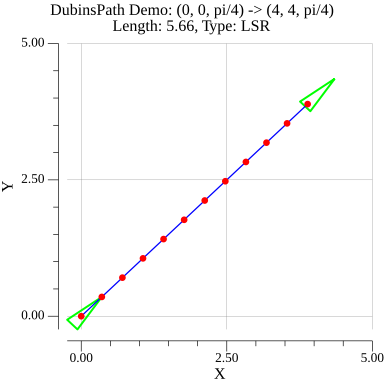
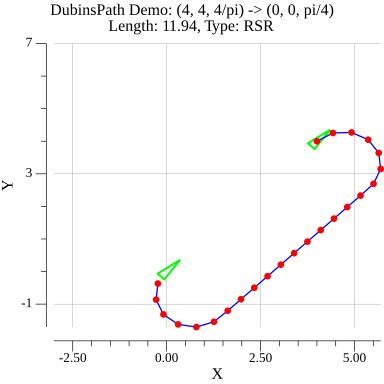

# dubins demo

> dubins Length, Interpolate demo, based on python [pydubins](https://github.com/AndrewWalker/pydubins) demo

## Results
|   |   |                     |
|:-------------------:|:-------------------:|:-------------------:|
|  |  |  |
|  |  |  |
|  |  |  |
|  | | |

## Run
```bash
go mod tidy
go run main.go
```

